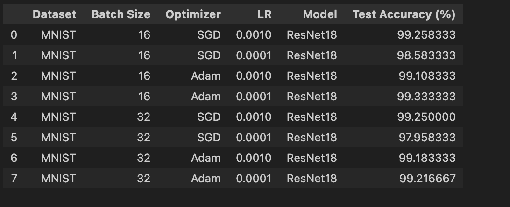
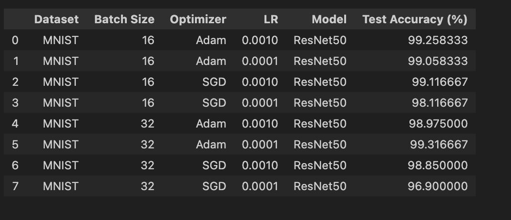
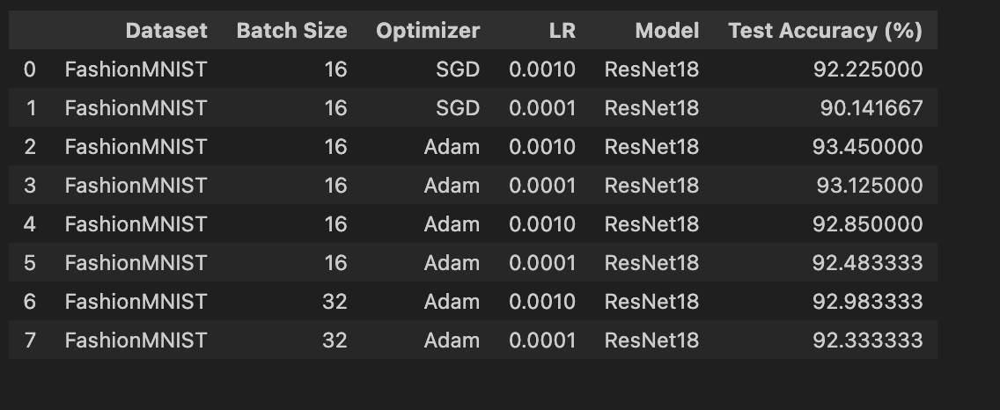
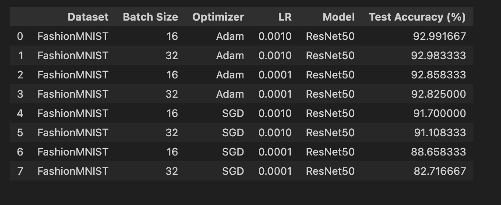
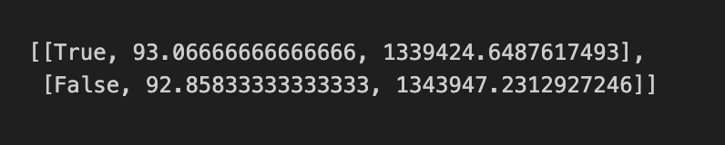
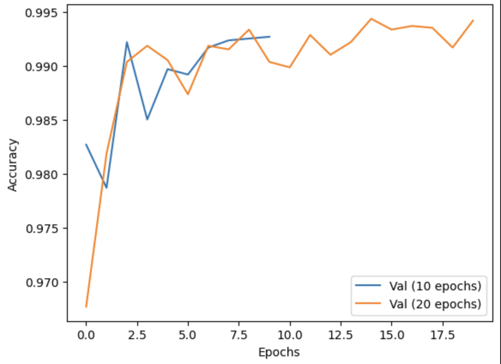
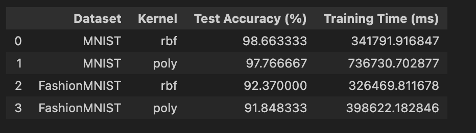

# MLOps-Sahilpreet_Singh-B23CS1061

## Google Colab Notebook
https://colab.research.google.com/drive/102lihgBAIuxX8q2DdsztyvbfVg_2fyIv

## Experimental Setup

- Datasets: MNIST, FashionMNIST
- Train / Validation / Test Split: 70% / 10% / 20%
- Models: ResNet18, ResNet50 (trained from scratch)
- Batch Sizes: 16, 32
- Optimizers: SGD, Adam
- Learning Rates: 0.001, 0.0001
- Epochs: 10 (default), 20 (for epoch comparison)
- Hardware: CPU and T4 GPU

### Question 1.

Results on **MNIST Dataset** for Resnet18 and Resnet50  

  
  

Results on **FashionMNIST Dataset** for Resnet18 and Resnet50  

  
  

### Results after varying hyperparameters for Resnet18 and Resnet50 on MNIST and FashionMNIST datasets.

1.) Pin Memory (True/False)

The table shows Pin Memory, Accuracy, Time Taken.

2.) Epochs  

    

### Question 1 part b.)

    

### Question 2.) The table below shows the comparison between cpu and gpu for accuracy/ time and FLOPs

## Analysis

1. Adam optimizer consistently outperforms SGD in both MNIST and FashionMNIST.
2. ResNet50 has significantly higher FLOPs and training time compared to ResNet18.
3. GPU provides nearly 20× speedup compared to CPU while maintaining similar accuracy.
4. Pin memory slightly improves training time without affecting accuracy.
5. Increasing epochs improves validation accuracy but saturates after ~10 epochs.
6. SVM performs competitively on MNIST but scales poorly in training time compared to deep models.

## Repository Structure

- dlops_Assignment.ipynb – Complete experiment notebook
- results_images/ – Training curves and result visualizations
- results_csv/ – Raw experimental results
- README.md – Summary of experiments and analysis
