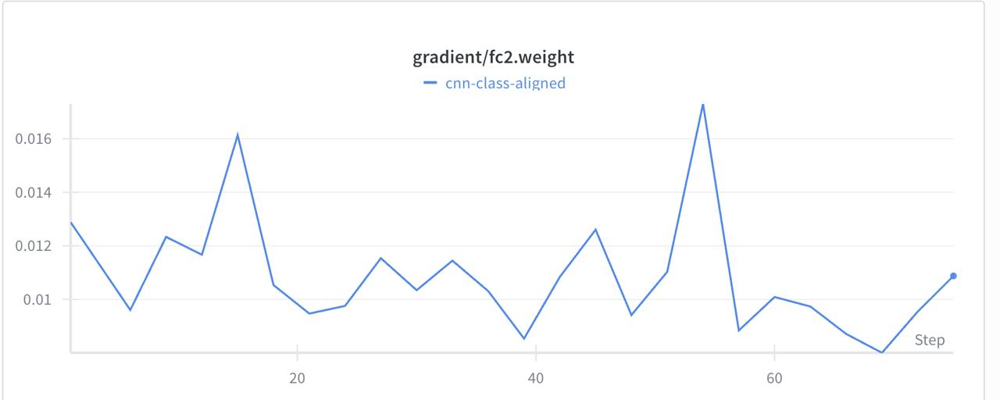
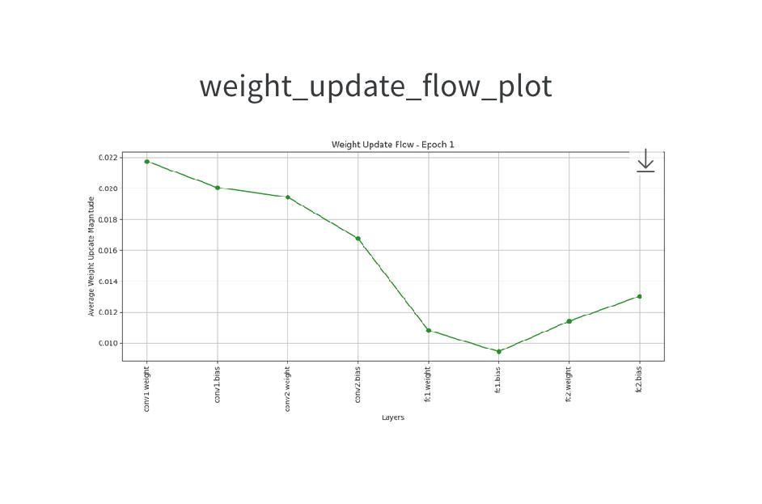

# Lab Worksheet Report  
## CNN Training and Analysis on CIFAR-10

**Name:** Sahilpreet Singh  
**Roll Number:** B23CS1061  
**Course:** ML-DL-OPS  
**Date:** 31 January 2026  

---

## Overview
This project implements a Convolutional Neural Network (CNN) for CIFAR-10 image classification.  
It includes a custom dataloader, FLOPs computation, gradient flow and weight update flow analysis, with full experiment tracking using Weights & Biases (WandB).

---

## Model Summary
- CNN with 2 convolution layers and 2 fully connected layers  
- **Total Parameters:** 1,070,794  
- **FLOPs (MACs):** 6,654,464  
- **Epochs:** 25  
- **Batch Size:** 128  

---

## Results
- **Training Accuracy:** ~79%  
- **Test Accuracy:** ~78%  
- Stable convergence across 25 epochs

---

## Findings & Observations
- The model showed smooth and consistent convergence during training.
- Gradient flow analysis indicated stable gradient propagation across all layers.
- No vanishing or exploding gradients were observed.
- Weight update flow demonstrated consistent parameter updates between epochs.
- Training and test accuracies were closely aligned, indicating good generalization.
- FLOPs analysis confirmed that the model is computationally efficient for CIFAR-10.

---

## Visualizations

### FLOPs and Parameter Count

### Gradient Flow Analysis

### Weight Update Flow

### WandB Run History and Summary

---

## WandB Dashboard
All training metrics and visualizations are logged here:  
👉 https://wandb.ai/ikamboj-919-iit-jodhpur/updated_cnn_cifar10

---

## Files
- `Lab2_Assignment1.ipynb` – Complete implementation and experiments  
- `report.pdf` – LaTeX report  
- `images/` – Visualization figures used in report and README  

---

## Submission
- GitHub repository (this folder)  
- Report (PDF)  
- WandB project link
