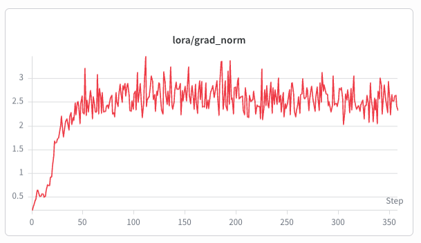
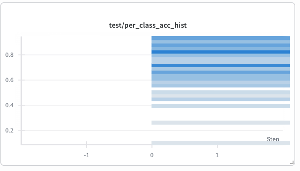
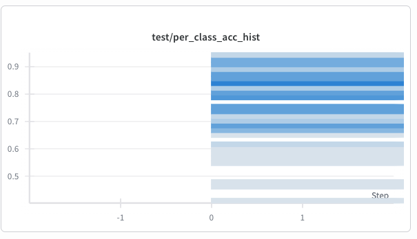
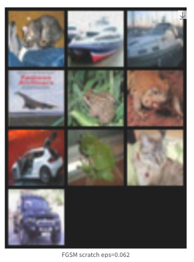
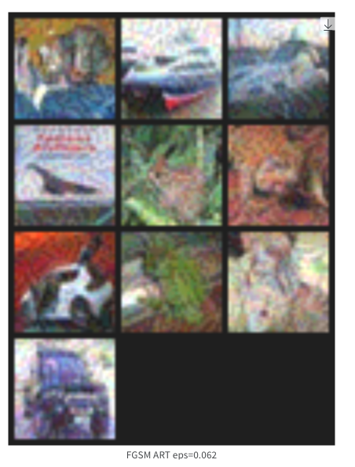
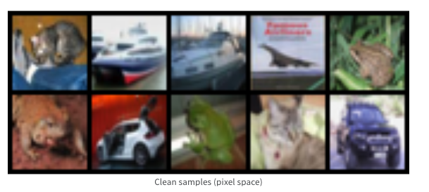
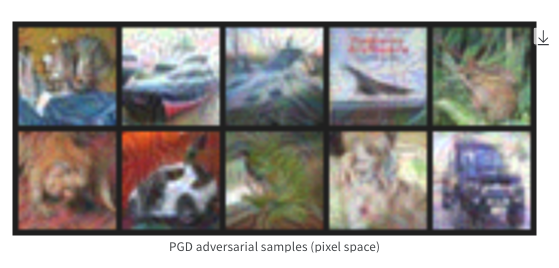
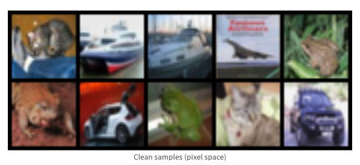

# Assignment 5 — Q1 & Q2 Results

This repository contains:
- **Q1:** ViT-S (ImageNet-pretrained) + LoRA fine-tuning on **CIFAR-100**
- **Q2:** Adversarial attacks (FGSM/PGD/BIM) on **CIFAR-10** + adversarial detection using **IBM ART**

## Quick Links

### External
- [W&B Project](https://wandb.ai/ikamboj-919-iit-jodhpur/final-ops-ass-5)
- [Hugging Face Weights Repo](https://huggingface.co/sps1001/Assignment-5-ops/tree/main)

W&B project (for figures, class-wise histograms, and gradients):
https://wandb.ai/ikamboj-919-iit-jodhpur/final-ops-ass-5

Hugging Face repo (uploaded weights):
https://huggingface.co/sps1001/Assignment-5-ops/tree/main

### Docker build

From repo root:

```bash
docker build -f docker/Dockerfile -t ass5-q1 .
```

### Docker run

From repo root:

```bash
docker run --rm -it --gpus all -v "$PWD:/workspace/ops-ass-5" ass5-q1 bash
```

CPU-only: remove `--gpus all`.

If you hit DataLoader shared-memory errors, either keep `--num-workers 0` (default) or run Docker with a larger shm:

```bash
docker run --rm -it --shm-size=8g --gpus all -v "$PWD:/workspace/ops-ass-5" ass5-q1 bash
```

### Baseline (head-only, no LoRA)

Inside container (in `/workspace/ops-ass-5`):

```bash
python -m q1.train_vit_cifar100 \
  --mode baseline \
  --model-name WinKawaks/vit-small-patch16-224 \
  --num-workers 0 \
  --epochs 10 \
  --batch-size 128 \
  --wandb 1 \
  --wandb-entity ikamboj-919-iit-jodhpur \
  --wandb-project final-ops-ass-5
```

### LoRA run (Q/K/V)

```bash
python -m q1.train_vit_cifar100 \
  --mode lora \
  --model-name WinKawaks/vit-small-patch16-224 \
  --num-workers 0 \
  --rank 4 \
  --alpha 8 \
  --dropout 0.1 \
  --epochs 10 \
  --batch-size 128 \
  --wandb 1 \
  --wandb-entity ikamboj-919-iit-jodhpur \
  --wandb-project final-ops-ass-5
```

### Optuna search (LoRA rank/alpha only)

```bash
python -m q1.optuna_lora_search \
  --trials 15 \
  --epochs 3 \
  --limit-train-batches 50 \
  --limit-val-batches 10 \
  --device cpu \
  --wandb 1 \
  --wandb-entity ikamboj-919-iit-jodhpur \
  --wandb-project final-ops-ass-5
```

### Eval (overall + class-wise histogram)

```bash
python -m q1.eval_vit_cifar100 \
  --mode baseline \
  --model-name WinKawaks/vit-small-patch16-224 \
  --num-workers 0 \
  --ckpt q1/outputs/best_q1-baseline-head-only.pt \
  --wandb 1 \
  --wandb-entity ikamboj-919-iit-jodhpur \
  --wandb-project final-ops-ass-5
```

## Q1 — Table 1 (Baseline head-only training/validation, 10 epochs)

Epoch-wise training loss/accuracy and validation loss/accuracy for the baseline (**head-only, no LoRA**) run.

| Epoch | Training loss | Validation loss | Training accuracy | Validation accuracy |
|------:|--------------:|----------------:|------------------:|----------------------:|
| 1 | 2.2699 | 1.2275 | 0.5286 | 0.7146 |
| 2 | 1.0102 | 0.9497 | 0.7476 | 0.7527 |
| 3 | 0.8284 | 0.8504 | 0.7780 | 0.7648 |
| 4 | 0.7426 | 0.8067 | 0.7953 | 0.7727 |
| 5 | 0.6882 | 0.7745 | 0.8074 | 0.7807 |
| 6 | 0.6470 | 0.7567 | 0.8175 | 0.7836 |
| 7 | 0.6151 | 0.7461 | 0.8265 | 0.7824 |
| 8 | 0.5903 | 0.7298 | 0.8318 | 0.7881 |
| 9 | 0.5684 | 0.7269 | 0.8365 | 0.7889 |
| 10 | 0.5491 | 0.7232 | 0.8418 | 0.7910 |

## Q1 — Epoch-wise train/val tables for ALL LoRA configurations (9 runs)

All LoRA runs inject adapters into attention (Q,K,V) with `dropout=0.1` and evaluate epoch-wise using the same train/val split that produces the baseline Table 1.

### Q1 — LoRA (Q,K,V) | rank=2 | alpha=2 | dropout=0.1 — Epoch-wise train/val

| Epoch | Training loss | Validation loss | Training accuracy | Validation accuracy |
|------:|--------------:|----------------:|------------------:|----------------------:|
| 1 | 4.7354 | 4.4796 | 0.0153 | 0.0334 |
| 2 | 4.0179 | 3.5911 | 0.0921 | 0.1570 |
| 3 | 3.3160 | 3.1183 | 0.2200 | 0.2648 |
| 4 | 2.9174 | 2.7963 | 0.3138 | 0.3496 |
| 5 | 2.6365 | 2.5746 | 0.3869 | 0.4027 |
| 6 | 2.4439 | 2.4207 | 0.4347 | 0.4410 |
| 7 | 2.3018 | 2.3019 | 0.4723 | 0.4729 |
| 8 | 2.1923 | 2.2082 | 0.4981 | 0.4955 |
| 9 | 2.1046 | 2.1375 | 0.5183 | 0.5082 |
| 10 | 2.0304 | 2.0634 | 0.5370 | 0.5285 |

### Q1 — LoRA (Q,K,V) | rank=2 | alpha=4 | dropout=0.1 — Epoch-wise train/val

| Epoch | Training loss | Validation loss | Training accuracy | Validation accuracy |
|------:|--------------:|----------------:|------------------:|----------------------:|
| 1 | 4.6525 | 4.2211 | 0.0231 | 0.0592 |
| 2 | 3.6105 | 3.1882 | 0.1575 | 0.2465 |
| 3 | 2.9045 | 2.7198 | 0.3239 | 0.3676 |
| 4 | 2.5306 | 2.4474 | 0.4155 | 0.4449 |
| 5 | 2.2953 | 2.2711 | 0.4740 | 0.4830 |
| 6 | 2.1376 | 2.1363 | 0.5136 | 0.5191 |
| 7 | 2.0184 | 2.0308 | 0.5451 | 0.5404 |
| 8 | 1.9247 | 1.9502 | 0.5703 | 0.5549 |
| 9 | 1.8483 | 1.8953 | 0.5891 | 0.5721 |
| 10 | 1.7849 | 1.8360 | 0.6024 | 0.5840 |

### Q1 — LoRA (Q,K,V) | rank=2 | alpha=8 | dropout=0.1 — Epoch-wise train/val

| Epoch | Training loss | Validation loss | Training accuracy | Validation accuracy |
|------:|--------------:|----------------:|------------------:|----------------------:|
| 1 | 4.5924 | 3.9906 | 0.0253 | 0.0773 |
| 2 | 3.2575 | 2.8078 | 0.2333 | 0.3385 |
| 3 | 2.5423 | 2.3845 | 0.4131 | 0.4480 |
| 4 | 2.2079 | 2.1613 | 0.4981 | 0.5127 |
| 5 | 2.0116 | 1.9955 | 0.5494 | 0.5486 |
| 6 | 1.8792 | 1.8904 | 0.5834 | 0.5828 |
| 7 | 1.7733 | 1.8019 | 0.6116 | 0.5971 |
| 8 | 1.6907 | 1.7222 | 0.6313 | 0.6168 |
| 9 | 1.6226 | 1.6656 | 0.6479 | 0.6307 |
| 10 | 1.5617 | 1.6210 | 0.6631 | 0.6396 |

### Q1 — LoRA (Q,K,V) | rank=4 | alpha=2 | dropout=0.1 — Epoch-wise train/val

| Epoch | Training loss | Validation loss | Training accuracy | Validation accuracy |
|------:|--------------:|----------------:|------------------:|----------------------:|
| 1 | 4.7559 | 4.5487 | 0.0126 | 0.0230 |
| 2 | 4.0346 | 3.4724 | 0.0874 | 0.1836 |
| 3 | 3.0866 | 2.8226 | 0.2794 | 0.3465 |
| 4 | 2.6014 | 2.4829 | 0.3988 | 0.4316 |
| 5 | 2.3286 | 2.2729 | 0.4695 | 0.4830 |
| 6 | 2.1415 | 2.1186 | 0.5144 | 0.5146 |
| 7 | 1.9996 | 2.0047 | 0.5509 | 0.5365 |
| 8 | 1.8812 | 1.8948 | 0.5783 | 0.5707 |
| 9 | 1.7827 | 1.8133 | 0.6026 | 0.5826 |
| 10 | 1.6981 | 1.7458 | 0.6244 | 0.6010 |

### Q1 — LoRA (Q,K,V) | rank=4 | alpha=4 | dropout=0.1 — Epoch-wise train/val

| Epoch | Training loss | Validation loss | Training accuracy | Validation accuracy |
|------:|--------------:|----------------:|------------------:|----------------------:|
| 1 | 4.6521 | 4.1585 | 0.0201 | 0.0604 |
| 2 | 3.3601 | 2.8422 | 0.2190 | 0.3371 |
| 3 | 2.5345 | 2.3592 | 0.4223 | 0.4576 |
| 4 | 2.1728 | 2.0974 | 0.5103 | 0.5236 |
| 5 | 1.9469 | 1.9147 | 0.5671 | 0.5652 |
| 6 | 1.7813 | 1.7774 | 0.6047 | 0.5992 |
| 7 | 1.6519 | 1.6877 | 0.6368 | 0.6125 |
| 8 | 1.5452 | 1.5832 | 0.6634 | 0.6428 |
| 9 | 1.4598 | 1.5150 | 0.6806 | 0.6615 |
| 10 | 1.3839 | 1.4415 | 0.6996 | 0.6762 |

### Q1 — LoRA (Q,K,V) | rank=4 | alpha=8 | dropout=0.1 — Epoch-wise train/val

| Epoch | Training loss | Validation loss | Training accuracy | Validation accuracy |
|------:|--------------:|----------------:|------------------:|----------------------:|
| 1 | 4.3584 | 3.3715 | 0.0579 | 0.2051 |
| 2 | 2.7394 | 2.3815 | 0.3698 | 0.4557 |
| 3 | 2.1295 | 1.9997 | 0.5242 | 0.5424 |
| 4 | 1.8244 | 1.7710 | 0.5980 | 0.5951 |
| 5 | 1.6220 | 1.6102 | 0.6463 | 0.6328 |
| 6 | 1.4696 | 1.4730 | 0.6825 | 0.6682 |
| 7 | 1.3506 | 1.3854 | 0.7118 | 0.6910 |
| 8 | 1.2554 | 1.3009 | 0.7345 | 0.7141 |
| 9 | 1.1730 | 1.2338 | 0.7544 | 0.7318 |
| 10 | 1.1042 | 1.1837 | 0.7700 | 0.7418 |

### Q1 — LoRA (Q,K,V) | rank=8 | alpha=2 | dropout=0.1 — Epoch-wise train/val

| Epoch | Training loss | Validation loss | Training accuracy | Validation accuracy |
|------:|--------------:|----------------:|------------------:|----------------------:|
| 1 | 4.7319 | 4.4035 | 0.0166 | 0.0416 |
| 2 | 3.6919 | 3.1142 | 0.1536 | 0.2650 |
| 3 | 2.7799 | 2.5811 | 0.3590 | 0.4082 |
| 4 | 2.3708 | 2.2701 | 0.4614 | 0.4879 |
| 5 | 2.1020 | 2.0446 | 0.5286 | 0.5340 |
| 6 | 1.8970 | 1.8662 | 0.5776 | 0.5744 |
| 7 | 1.7333 | 1.7272 | 0.6172 | 0.6090 |
| 8 | 1.5994 | 1.6155 | 0.6506 | 0.6273 |
| 9 | 1.4865 | 1.5103 | 0.6734 | 0.6604 |
| 10 | 1.3896 | 1.4240 | 0.6957 | 0.6791 |

### Q1 — LoRA (Q,K,V) | rank=8 | alpha=4 | dropout=0.1 — Epoch-wise train/val

| Epoch | Training loss | Validation loss | Training accuracy | Validation accuracy |
|------:|--------------:|----------------:|------------------:|----------------------:|
| 1 | 4.5421 | 3.7459 | 0.0359 | 0.1254 |
| 2 | 2.9974 | 2.5641 | 0.3051 | 0.4076 |
| 3 | 2.2805 | 2.1180 | 0.4820 | 0.5139 |
| 4 | 1.9178 | 1.8350 | 0.5708 | 0.5799 |
| 5 | 1.6766 | 1.6331 | 0.6280 | 0.6303 |
| 6 | 1.4916 | 1.4777 | 0.6719 | 0.6664 |
| 7 | 1.3459 | 1.3523 | 0.7090 | 0.7002 |
| 8 | 1.2292 | 1.2522 | 0.7335 | 0.7127 |
| 9 | 1.1330 | 1.1664 | 0.7558 | 0.7312 |
| 10 | 1.0505 | 1.1050 | 0.7756 | 0.7486 |

### Q1 — LoRA (Q,K,V) | rank=8 | alpha=8 | dropout=0.1 — Epoch-wise train/val

| Epoch | Training loss | Validation loss | Training accuracy | Validation accuracy |
|------:|--------------:|----------------:|------------------:|----------------------:|
| 1 | 4.2160 | 3.0433 | 0.0871 | 0.2859 |
| 2 | 2.4636 | 2.1178 | 0.4354 | 0.5227 |
| 3 | 1.8565 | 1.7173 | 0.5863 | 0.6090 |
| 4 | 1.5213 | 1.4506 | 0.6668 | 0.6662 |
| 5 | 1.3004 | 1.2721 | 0.7186 | 0.7061 |
| 6 | 1.1385 | 1.1342 | 0.7563 | 0.7414 |
| 7 | 1.0154 | 1.0357 | 0.7832 | 0.7689 |
| 8 | 0.9188 | 0.9652 | 0.8060 | 0.7750 |
| 9 | 0.8401 | 0.8958 | 0.8210 | 0.7934 |
| 10 | 0.7770 | 0.8602 | 0.8363 | 0.7961 |

## Testing Results (CIFAR-100 test set)

Your assignment requires the “Testing table” to include **overall test accuracy for all 9 LoRA settings**:
`rank in {2,4,8}` and `alpha in {2,4,8}` with `dropout=0.1`, plus the **baseline (no LoRA)**.

Use `python -m q1.eval_vit_cifar100` and the matching checkpoint in `q1/outputs/`.

| LoRA layers | Rank | Alpha | Dropout | Overall Test Accuracy | Trainable Parameters used |
|---|---:|---:|---:|---:|---:|
| Without LoRA (head-only) | - | - | - | 0.7901 | 38,500 |
| With LoRA (Q,K,V) | 2 | 2 | 0.1 | 0.5314 | 55,296 |
| With LoRA (Q,K,V) | 2 | 4 | 0.1 | 0.5901 | 55,296 |
| With LoRA (Q,K,V) | 2 | 8 | 0.1 | 0.6387 | 55,296 |
| With LoRA (Q,K,V) | 4 | 2 | 0.1 | 0.6104 | 110,592 |
| With LoRA (Q,K,V) | 4 | 4 | 0.1 | 0.6849 | 110,592 |
| With LoRA (Q,K,V) | 4 | 8 | 0.1 | 0.7408 | 110,592 |
| With LoRA (Q,K,V) | 8 | 2 | 0.1 | 0.6869 | 221,184 |
| With LoRA (Q,K,V) | 8 | 4 | 0.1 | 0.7530 | 221,184 |
| With LoRA (Q,K,V) | 8 | 8 | 0.1 | 0.8046 | 221,184 |

All 8 remaining LoRA evaluations are completed (see `test_updated.log`), so the Testing Results table above is final.

Optuna (LoRA-only) best hyperparameters: `rank=4`, `alpha=8`, `dropout=0.1` (overall test accuracy `0.7408`) with checkpoint `q1/outputs/best_q1-lora-r4-a8-d0.1-full.pt`.

### Q1 Figures (export from W&B → put PNGs in `images/`)
Use the following filenames (the `images/` folder will be added to the repo later):

1.1 Gradient update graphs on LoRA weights  
`images/1.1.png`

1.2 Class-wise test accuracy histogram/table for **best LoRA**  
`images/1.2.png`

1.3 Class-wise test accuracy histogram/table for **baseline (no LoRA)**  
`images/1.3.png`

Export sources (W&B):
- Figure 1.1 (LoRA gradient-update traces) from best LoRA training run `bohii2ix`: https://wandb.ai/ikamboj-919-iit-jodhpur/final-ops-ass-5/runs/bohii2ix
- Figure 1.2 (class-wise histogram for best LoRA) from eval run `sgoyh0dz`: https://wandb.ai/ikamboj-919-iit-jodhpur/final-ops-ass-5/runs/sgoyh0dz
- Figure 1.3 (class-wise histogram for baseline) from eval run `mtfbddj6`: https://wandb.ai/ikamboj-919-iit-jodhpur/final-ops-ass-5/runs/mtfbddj6





## Q2 Results (CIFAR-10) — FGSM, PGD, BIM (IBM ART)

W&B project:
https://wandb.ai/ikamboj-919-iit-jodhpur/final-ops-ass-5

### Q2 ResNet18 training dynamics (logged per epoch)

The Q2 training log records **train loss/accuracy** and **test loss/accuracy** per epoch (no separate validation split in the logger). The table below summarizes epochs 1–10.

| Epoch | Train loss | Train acc. | Test loss | Test acc. |
|------:|-----------:|------------:|----------:|-----------:|
| 1 | 2.2954 | 0.2609 | 1.6602 | 0.3772 |
| 2 | 1.5774 | 0.4146 | 1.3920 | 0.4890 |
| 3 | 1.3653 | 0.5015 | 1.2159 | 0.5611 |
| 4 | 1.1877 | 0.5741 | 1.2381 | 0.5603 |
| 5 | 1.0499 | 0.6268 | 1.0248 | 0.6372 |
| 6 | 0.9690 | 0.6591 | 0.9519 | 0.6739 |
| 7 | 0.9029 | 0.6847 | 1.0633 | 0.6477 |
| 8 | 0.8528 | 0.7046 | 0.9086 | 0.6796 |
| 9 | 0.8173 | 0.7144 | 0.7935 | 0.7262 |
| 10 | 0.7790 | 0.7309 | 0.8277 | 0.7197 |

### Q2(i) ResNet18 + FGSM (scratch vs IBM ART) — Table 3

**Clean test accuracy:** `0.8583` (checkpoint: `q2/outputs/best_q2-resnet18-cifar10.pt`)

| ε | Clean acc. | FGSM scratch acc. | FGSM ART acc. | Δ clean → scratch | Δ clean → ART |
|--:|-----------:|------------------:|--------------:|------------------:|----------------:|
| 0.000 | 0.8601 | 0.8601 | 0.8601 | 0.0000 | 0.0000 |
| 0.002 | 0.8601 | 0.8376 | 0.7453 | 0.0225 | 0.1148 |
| 0.004 | 0.8601 | 0.8134 | 0.6237 | 0.0467 | 0.2364 |
| 0.008 | 0.8601 | 0.7702 | 0.4222 | 0.0899 | 0.4379 |
| 0.016 | 0.8601 | 0.6727 | 0.1849 | 0.1874 | 0.6752 |
| 0.031 | 0.8601 | 0.4997 | 0.0480 | 0.3604 | 0.8121 |
| 0.062 | 0.8601 | 0.2667 | 0.0157 | 0.5934 | 0.8444 |

#### Q2 Figures — FGSM (10 samples clean vs adversarial; scratch & ART)
Export from W&B run `gmgefz8f`:
https://wandb.ai/ikamboj-919-iit-jodhpur/final-ops-ass-5/runs/gmgefz8f

Save as:
- Figure 2.11 (FGSM clean, 10 samples): `images/2.11.png`
- Figure 2.12 (FGSM scratch adversarial, 10 samples): `images/2.12.png`
- Figure 2.13 (FGSM ART adversarial, 10 samples): `images/2.13.png`





### Q2(ii) Adversarial Detectors (ResNet34) — Tables 4–5

Requirement: detector accuracy ≥ 70% for each attack type.

| Detector training data | Best test accuracy | Checkpoint |
|------------------------|---------------------:|------------|
| Clean + PGD (ART) | 0.9756 | `q2/outputs/detector/pgd/best_q2-detector-pgd-resnet34.pt` |
| Clean + BIM (ART) | 0.9600 | `q2/outputs/detector/bim/best_q2-detector-bim-resnet34.pt` |

Table 4 — PGD detector: train/test accuracy by epoch

| Epoch | Train loss | Train acc. | Test acc. |
|------:|-----------:|-----------:|----------:|
| 1 | 0.7485 | 0.5372 | 0.5510 |
| 2 | 0.3391 | 0.8419 | 0.7208 |
| 3 | 0.1327 | 0.9487 | 0.9443 |
| 4 | 0.0861 | 0.9665 | 0.8954 |
| 5 | 0.0783 | 0.9699 | 0.9433 |
| 6 | 0.0578 | 0.9794 | 0.9623 |
| 7 | 0.0410 | 0.9851 | 0.9488 |
| 8 | 0.0303 | 0.9887 | 0.9756 |
| 9 | 0.0368 | 0.9868 | 0.8045 |
| 10 | 0.0417 | 0.9857 | 0.9463 |

Table 5 — BIM detector: train/test accuracy by epoch

| Epoch | Train loss | Train acc. | Test acc. |
|------:|-----------:|-----------:|----------:|
| 1 | 0.7262 | 0.5642 | 0.6687 |
| 2 | 0.3290 | 0.8541 | 0.7671 |
| 3 | 0.1401 | 0.9456 | 0.8808 |
| 4 | 0.0973 | 0.9634 | 0.9468 |
| 5 | 0.0701 | 0.9746 | 0.9327 |
| 6 | 0.0715 | 0.9731 | 0.9574 |
| 7 | 0.0464 | 0.9827 | 0.9346 |
| 8 | 0.0480 | 0.9831 | 0.7567 |
| 9 | 0.0390 | 0.9859 | 0.8696 |
| 10 | 0.0403 | 0.9851 | 0.9600 |

#### Q2 Figures — PGD detector (clean vs PGD adversarial)
Export from W&B run `1lfee2h4`:
https://wandb.ai/ikamboj-919-iit-jodhpur/final-ops-ass-5/runs/1lfee2h4

Save as:
- Figure 2.21 (clean, 10 samples): `images/2.21.png`
- Figure 2.22 (PGD adversarial, 10 samples): `images/2.22.png`




#### Q2 Figures — BIM detector (clean vs BIM adversarial)
Export from W&B run `p7l4uhui`:
https://wandb.ai/ikamboj-919-iit-jodhpur/final-ops-ass-5/runs/p7l4uhui

Save as:
- Figure 2.31 (clean, 10 samples): `images/2.31.png`
- Figure 2.32 (BIM adversarial, 10 samples): `images/2.32.png`




## How to reproduce Q2 (Docker + exact commands)

Run Q2 inside the required Docker container from repo root (`/workspace/ops-ass-5` inside the container).

### 1) Docker

Build:
```bash
docker build -f q2/Dockerfile -t ass5-q2 .
```

Run:
```bash
docker run --rm -it --gpus all -v "$PWD:/workspace/ops-ass-5" ass5-q2 bash
```

CPU-only: remove `--gpus all`.

Optional: login to W&B inside container:
```bash
wandb login
```

All Q2 scripts accept:
- `--wandb 1`
- `--wandb-entity ikamboj-919-iit-jodhpur`
- `--wandb-project final-ops-ass-5`

### 2) Q2(i) Train ResNet18 (clean)

```bash
python -m q2.train_resnet18_cifar10 \
  --epochs 30 \
  --batch-size 128 \
  --device cuda \
  --wandb 1 \
  --wandb-entity ikamboj-919-iit-jodhpur \
  --wandb-project final-ops-ass-5
```

This produces the checkpoint `q2/outputs/best_q2-resnet18-cifar10.pt` (or your `--wandb-run-name` variant).

### 3) Q2(i) FGSM: scratch vs IBM ART

```bash
python -m q2.fgsm_compare \
  --ckpt q2/outputs/best_q2-resnet18-cifar10.pt \
  --device cuda \
  --eps-list 0,0.002,0.004,0.008,0.016,0.031,0.062 \
  --wandb 1 \
  --wandb-entity ikamboj-919-iit-jodhpur \
  --wandb-project final-ops-ass-5
```

This saves `q2/outputs/fgsm/orig.png` and adversarial examples under `q2/outputs/fgsm/` (and logs the epsilon-sweep table to W&B).

### 4) Q2(ii) Adversarial detectors (PGD and BIM via ART)

PGD detector:
```bash
python -m q2.train_detector \
  --attack pgd \
  --base-ckpt q2/outputs/best_q2-resnet18-cifar10.pt \
  --eps 0.031 \
  --steps 10 \
  --step-size 0.007 \
  --epochs 10 \
  --device cuda \
  --wandb 1 \
  --wandb-entity ikamboj-919-iit-jodhpur \
  --wandb-project final-ops-ass-5
```

BIM detector:
```bash
python -m q2.train_detector \
  --attack bim \
  --base-ckpt q2/outputs/best_q2-resnet18-cifar10.pt \
  --eps 0.031 \
  --steps 10 \
  --step-size 0.007 \
  --epochs 10 \
  --device cuda \
  --wandb 1 \
  --wandb-entity ikamboj-919-iit-jodhpur \
  --wandb-project final-ops-ass-5
```

